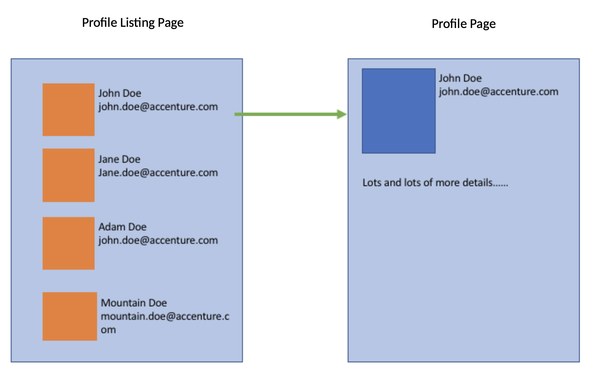

# Task 3



You have 15 minutes to create a technical design to prepare this solution from the scratch.

Some things you might consider:
- What data do you need and how would you design the APIs?
- How do you structure your UI components?
- How would you structure your code?
- How might SPA/React affect this?

## Technical design

- **What data do you need and how would you design the APIs?**

  In this example we will implement a set of REST API endpoints as follows.
  Other options to evaluate could be GraphQL or [JSON:API](https://jsonapi.org/), for example.

  ###  Lists all profiles

  In the interest of brevity, this example doesn't include pagination that may be necessary if there are
  many profiles. To optimize the resources the client should request a specific set of fields. This needs to be
  weighted against the caching of such data on the CDN.

  `GET ~/v1/profiles?fields=id,name,email,smallImage`
  ```json
  {
    "data": [
      {
        "id": "profile-1",
        "name": "John Doe",
        "email": "john.doe@accenture.com",
        "smallImage": "...-orange.jpg",
        "links": {
          "profile": "https://api.example.com/v1/profiles/profile-1"
        }
      }
    ]
  }
  ```

  ###  Get profile

  Returns all the profile data but not the details (the example states that there are "lots and lots" of them)

  `GET ~/v1/profiles/:id`
  ```json
  {
    "data": {
      "id": "profile-1",
      "name": "John Doe",
      "email": "john.doe@accenture.com",
      "largeImage": "...-blue.jpg",
      "links": {
        "details": "https://api.example.com/v1/profiles/profile-1/details"
      }
    }
  }
  ```

  ###  Get profile details

  The example states that there are "lots and lots" of details, so we should implement pagination.
  The browser can then make a series of request to load the data in batches following the links.
  The browser should display a loading placeholder and handle network or application errors.

  `GET ~/v1/profiles/:id/details`
  ```json
  {
    "pagination": {
      "offset": 0,
      "limit": 50,
      "total": 1337
    },
    "data": [
      {
        "id": "detail-1",
        "value": "Detail 1"
      },
      {
        "id": "detail-2",
        "value": "Detail 2"
      }
    ],
    "links": {
      "next": "https://api.example.com/v1/profiles/profile-1/details?offset=50&limit=50"
    }
  }
  ```

- **How do you structure your UI components?**

  The UI folder structure could be organised by page with Storybook stories and tests.
  Reusable shared components could be stored in a folder unrelated to pages.

  If the complexity of the project grows I would evaluate
  [Component Driven](https://www.componentdriven.org/) methodology

  ```
  .
  ├── App.js
  ├── components/
  ├── profile/
  │   ├── index.jsx
  │   ├── Profile.css
  │   ├── Profile.jsx
  │   ├── Profile.stories.jsx
  │   └── Profile.test.jsx
  └── profiles/
      ├── index.jsx
      ├── ProfileList.css
      ├── ProfileList.jsx
      ├── ProfileList.stories.jsx
      └── ProfileList.test.jsx
  ```

- **How would you structure your code?**

  Assuming it is a nodejs and react app we would need all the usual boilerplate, like `package.json`.
  We could evaluate to use `create-react-app` or similar to bootstrap the development.
  `README.md` should have at least some concise information about the project,
  how to get the codebase on the developers' machines and how to run the software
  `public/` could contain static files to serve to the users, ideally deployed to a CDN.
  `src/` could contain the server-side code to kick off the server side rendering of the react app.

  ```
  .
  ├── README.md
  ├── node_modules/
  ├── package.json
  ├── package-lock.json
  ├── public/
  │   └── favicon.ico
  └── src/
      ├── index.js
      └── index.test.js
  ```

- **How might SPA/React affect this?**

  Single page applications affect the development process in many ways.
  For example, we may need to implement client-side routing (History API) to be able to navigate between the pages
  on the client-side without a full round-trip to the server.

  Handling both server-side and client-side rendering and routing is often tricky and counter-intuitive
  to the developer team. For example, there are no safety nets in place by default to avoid private
  javascript modules to end up in the client-side bundle.

  Further complications include handling client-side network or application errors and loading placeholders for
  data being transferred.

  The advantages are that better speed and caching can be achieved if the pages are not reloaded from the server
  on each transition.

  React provides a structured and commonly understood set of patterns to implement SPAs. There is also great
  tooling available to support the development needs.

  Further there are some more advanced topics to evaluate, such as complexities in logging data in SSR/SPA,
  performance metrics tracking and Security in a mixed context like that.
